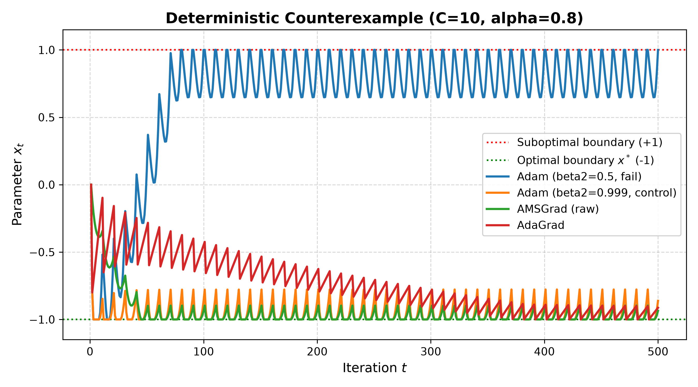
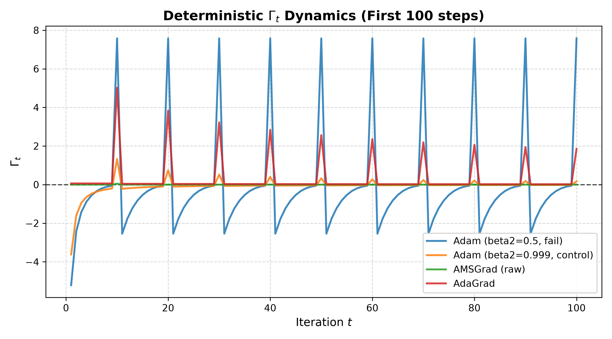
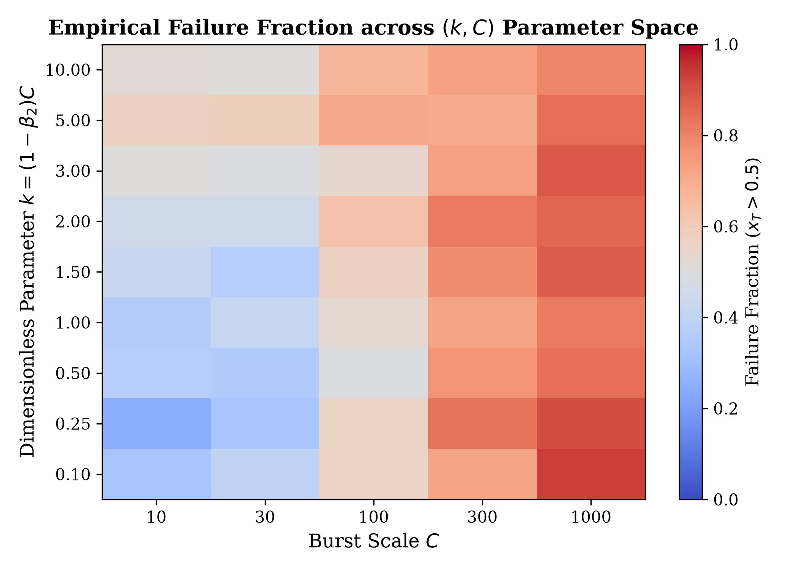
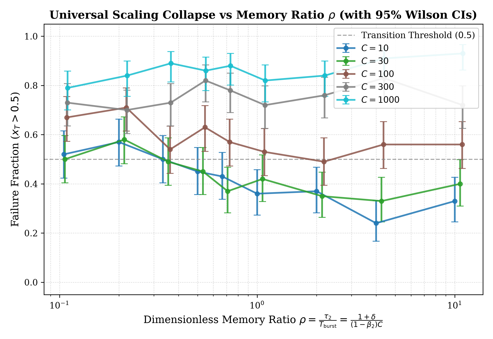

# Adam to AMSGrad: Exact Counterexample Replication, Diagnostic Dynamics, and Phase-Boundary Scaling

[](LICENSE)
[](https://www.python.org/downloads/)
[](tests/)
[](report/main.pdf)

A rigorous, from-scratch NumPy replication and research extension of the foundational adaptive optimization literature:
1. **Kingma & Ba (2014)**: *Adam: A Method for Stochastic Optimization* (ICLR 2015).
2. **Reddi, Kale & Kumar (2018)**: *On the Convergence of Adam and Beyond* (ICLR 2018).

This repository contains:
- Complete NumPy implementations of **SGD**, **Momentum SGD**, **AdaGrad**, **RMSProp**, **Adam**, and **AMSGrad**.
- Exact mathematical reconstructions of both **Deterministic (Theorem 3)** and **Stochastic (Section 3)** counterexamples from Reddi et al.
- Live **$\Gamma_t$ Diagnostic Instrumentation** logging the Online Convex Optimization (OCO) semi-definiteness condition $\Gamma_t = \frac{\sqrt{v_t}}{\alpha_t} - \frac{\sqrt{v_{t-1}}}{\alpha_{t-1}}$.
- An original **Pre-Registered Phase-Boundary Extension** across $4{,}500$ stochastic runs ($N=100$ seeds per cell) in $(k, C)$ parameter space with 95% Wilson confidence intervals and data collapse.
- A publication-ready 6-page research paper: [**`report/main.pdf`**](report/main.pdf).

---

## 📊 Key Findings & Figures

### 1. Deterministic Counterexample Divergence & $\Gamma_t$ Breakdown
In the periodic counterexample ($C=10$), Adam ($\beta_2=0.5$) experiences rapid exponential decay of $v_t$ during non-burst steps ($g_t=-1$), taking oversized positive steps that pin $x_T = +1.0000$. AMSGrad and AdaGrad enforce monotonic accumulators ($\Gamma_t \ge 0$), converging steadily to $x^* = -1.0$.

| Parameter Trajectories $x_t$ ($C=10$) | $\Gamma_t$ Metric Diagnostic Plunge |
| :---: | :---: |
|  |  |

### 2. Phase-Boundary Scaling & Data Collapse
Sweeping the dimensionless ratio $\rho = \frac{\tau_2}{T_{\text{burst}}} = \frac{1+\delta}{(1-\beta_2)C}$ across $C \in [10, 1000]$ reveals that Adam's divergence vulnerability compounds super-linearly with burst sparsity (observed deterministic OLS slope $-3.78 \pm 1.60$, refuting simple $C^{-1}$ scaling).

| Empirical Failure Heatmap in $(k, C)$ Space | Universal Data Collapse vs $\rho$ |
| :---: | :---: |
|  |  |

---

## 🛠️ Repository Map

```
AMS-grad/
├── LICENSE                                # MIT License
├── README.md                              # Project documentation
├── requirements.txt                       # Pure NumPy, SciPy, Matplotlib, Seaborn, Pytest
├── pytest.ini                             # Pytest config
├── notes/                                 # Mathematical notes & derivation track
│   ├── reading-log.md                     # Three-pass paper reading notes
│   ├── phase2_sgd_vs_adam.md              # Comparative mechanics of momentum vs coordinate scaling
│   ├── derivations.md                     # Complete step-by-step Gamma_t proof & AMSGrad resolution
│   └── paper_fidelity_checklist.md       # Exact transcription and parameter comparison against literature
├── src/
│   ├── diagnostics.py                     # ConvergenceTracker: logs v_t, v̂_t, Gamma_t, regret R_t, slope
│   ├── optimizers/                        # Pure NumPy vectorized optimizers
│   │   ├── base.py                        # BaseOptimizer with domain projection Pi_F and vectorized seeds
│   │   ├── sgd.py                         # Vanilla SGD & Momentum SGD
│   │   ├── adagrad.py                     # AdaGrad (positive control)
│   │   ├── rmsprop.py                     # RMSProp
│   │   ├── adam.py                        # Exact Kingma & Ba Adam with step debiasing
│   │   └── amsgrad.py                     # Exact Reddi et al. AMSGrad (raw & debiased modes)
│   ├── benchmarks/                        # 2D Landscapes & 1D Counterexample environments
│   │   ├── toy_functions.py               # Quadratic Bowl, Rosenbrock, Himmelblau
│   │   └── counterexample.py              # Deterministic (Thm 3) & Stochastic (Sec 3)
│   └── visualization/                     # Vector plotting utilities
├── experiments/
│   ├── 00_pilot_calibration.py            # Phase 3 pilot verifying assertion margins
│   ├── 01_toy_benchmarks.py               # Phase 2 2D optimization benchmarks
│   ├── 02_counterexample_reproduction.py  # Phase 3 Adam divergence vs AMSGrad convergence
│   ├── 03_beta2_phase_boundary.py         # Phase 4 sensitivity sweep (N=100 seeds)
│   ├── analyze_phase4.py                  # Phase 4 statistical analysis (OLS, Wilson CIs, Saturation)
│   └── run_all.py                         # Unified end-to-end execution pipeline
├── results/                               # Exported datasets (CSVs & JSON summaries)
│   ├── phase4_grid_results.csv            # Full 4,500-run stochastic grid results
│   ├── phase4_with_wilson_ci.csv          # Grid results with exact 95% Wilson confidence intervals
│   ├── deterministic_boundary.csv         # Bracketed deterministic k* and beta2* per C
│   ├── phase4_saturation_check.csv        # 2x T horizon saturation check results
│   └── phase4_summary.json                # Summary statistics, OLS slope, and verdicts
├── notebooks/                             # Interactive Jupyter notebooks
│   ├── 01_optimizer_foundations.ipynb     # 2D landscape exploration & dynamics
│   ├── 02_amsgrad_reproduction.ipynb      # Counterexample reconstruction & Gamma_t dips
│   └── 03_phase_boundary_analysis.ipynb   # Phase boundary analysis & data collapse
└── report/                                # Publication-ready LaTeX paper
    ├── main.tex                           # Main document
    ├── main.pdf                           # Compiled 6-page research report
    ├── references.bib                     # Curated bibliography
    ├── figures/                           # Vector PDF & PNG figures
    └── sections/                          # Modular LaTeX sections
```

---

## ⚡ Quick Start & Reproduction

### 1. Environment Setup
```bash
python3 -m venv .venv
source .venv/bin/activate
pip install -r requirements.txt
```

### 2. Run Test Suite
```bash
pytest -v
```
*All 12 automated unit and integration tests run and pass in $< 1$ second.*

### 3. Run End-to-End Pipeline
```bash
python experiments/run_all.py
```
*Expected total wall-clock runtime: $\approx 50$ seconds.*

---

## 📜 Research Paper Summary

The full paper is available at [**`report/main.pdf`**](report/main.pdf).

- **Title**: *From Adam to AMSGrad: Exact Counterexample Replication, Diagnostic Dynamics, and Phase-Boundary Scaling*
- **Length**: 6 pages, 7 vector figures, 2 tables, 8 bibliography references.
- **Pre-Registered Verdict**: The deterministic scaling slope was fitted at $-3.78 \pm 1.60$ ($R^2 = 0.88$), refuting the simple $C^{-1}$ scaling law and establishing that Adam's vulnerability grows super-linearly as consecutive non-burst steps drain the first moment.

---

## 📄 License
This project is released under the [MIT License](LICENSE).
